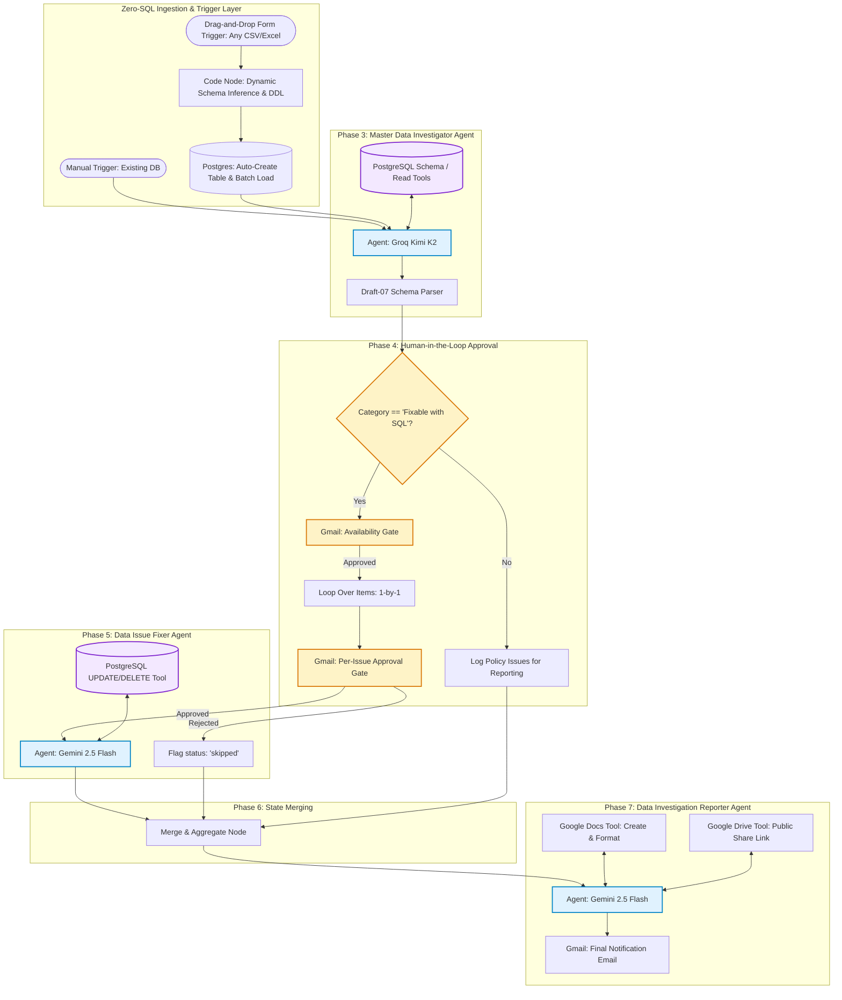

# AI Data Governor — Autonomous Data-Quality Audit & Remediation Agent

[](https://n8n.io/)
[](https://www.postgresql.org/)
[](https://groq.com/)
[](https://deepmind.google/technologies/gemini/)
[](https://opensource.org/licenses/MIT)

> **An enterprise-grade, multi-agent AI system orchestrated via n8n that audits PostgreSQL sales and forecast databases for data-quality anomalies, enforces human approval gates, applies targeted SQL remediations, and delivers executive-ready Google Doc health check reports.**

---

## Architecture & Execution Flow



---

## Zero-SQL Drag-and-Drop Ingestion Engine

> **The Problem**: Onboarding a new dataset traditionally meant manually opening Supabase's SQL editor and executing three separate scripts (`01_create_tables.sql`, `01b_insert_raw_data.sql`, `02_verify_baseline_issues.sql`) before any audit could even begin. That manual friction undercut the entire value proposition of automated data governance and tightly coupled the pipeline to a single static schema.
> 
> **The Solution**: Built a zero-SQL drag-and-drop ingestion path directly into the n8n workflow. An **n8n Form Trigger** accepts any CSV or Excel file via web form, a **JavaScript Code Node** infers the schema on the fly (normalizing headers to `snake_case`, inferring resilient PostgreSQL data types, and generating dynamic DDL), and **Postgres Nodes** auto-create the table and batch-load the rows. The freshly ingested table immediately flows into the **Master Data Investigator Agent** for autonomous audit. No manual SQL required, and the engine is completely dataset-agnostic.

---

## The Problem: Real-World "Dirty" Data Profiling

Incoming transactional datasets are rarely ready for enterprise reporting or predictive modeling. Profiling the raw AtliQ dataset surfaced 7 critical ground-truth anomalies:

| # | Issue Category | Target Location | Ground-Truth Evidence | Remediation Strategy |
|---|---|---|---|---|
| **1** | **Missing / Blank Values** | `dim_customer`, `dim_market`, `dim_product` | 10 blank customer names, 8 blank platforms, 10 null product categories, 20 null variants | Automated imputation or business policy flagging |
| **2** | **Placeholder Tokens** | `dim_customer.platform`, `dim_product.category` | Multiple encodings for unknown: `"UNKNOWN"`, `"-"`, `null` | Standardize placeholders using `NULLIF()` |
| **3** | **Mixed Types in Numeric Columns** | `fact_sales_monthly.sold_quantity`, `fact_forecast_monthly.forecast_quantity` | **10.0% of rows (2,150 sales & 2,180 forecast rows)** contain string suffixes like `"9 units"` | `REGEXP_REPLACE(sold_quantity, '[^0-9]', '', 'g')` |
| **4** | **Inconsistent Naming & Whitespace** | `dim_customer.customer` | `"Atliq Exclusive"` vs `"AltiQ Exclusive"`; 26 customer rows with trailing `"Amazon "` | `TRIM()` and `INITCAP()` standardization |
| **5** | **Referential Integrity Violations** | `fact_sales_monthly.customer_code`, `fact_sales_monthly.market` | **1,036 orphan customer codes** (1,026 following placeholder `ZZZ####` pattern); `"Canada"` missing in `dim_market` | Surface orphan codes; flag for dimension backfill |
| **6** | **Duplicate Records** | Facts & Dimensions | 610 duplicate sales rows, 514 duplicate forecast rows, 9 customer duplicates | Primary key and composite deduplication queries |
| **7** | **Missing Dimension Linkage** | Facts | 1,073 sales and 1,080 forecast rows have `customer_code` populated but NULL `customer_name` | Join repair from `dim_customer` |

---

## Architectural Principles & Safeguards

1. **Separation of Agent Concerns**:
   - **Master Data Investigator (Groq / Kimi K2)**: Optimized for fast, inexpensive token consumption over large read queries. Strictly read-only tools.
   - **Data Issue Fixer (Gemini 2.5 Flash)**: Receives isolated issue context, generates scoped PostgreSQL DML (`UPDATE`, `DELETE`), and executes queries. **DDL (`DROP`, `ALTER`, `TRUNCATE`) is strictly prohibited.**
   - **Data Investigation Reporter (Gemini 2.5 Flash)**: Formats document hierarchy (16pt title, 14pt headings, 11pt body, padded SQL blocks) and orchestrates Google Drive permissions.
2. **Mandatory Human-in-the-Loop Gating**:
   - *Tier 1 (Availability Gate)*: Asks the data steward for review availability via `sendAndWait` before sending individual notifications.
   - *Tier 2 (Per-Issue Approval Gate)*: Presents exact issue description, sample values, and suggested SQL fix. Rejections are marked `status: "skipped"` with 0 database modifications.
3. **Contract Enforcement via Draft-07 JSON Schema**:
   - Structured Output Parsers enforce strict schemas on all agent responses, eliminating hallucinated formatting and markdown noise.

---

## Project Structure

```text
ai-data-governer/
├── data/
│   ├── raw/                      # Original dirty dataset (dim & fact tables)
│   └── synthetic_raw/            # Public sanitized synthetic dataset
├── docs/
│   ├── agent_specifications.md   # Prompts, Draft-07 schemas, and tool bindings
│   ├── interview_narrative.md    # 2-minute pitch & technical defense
│   ├── linkedin_post.md          # Announcement post draft
│   └── reference/                # Implementation reference guides
├── scripts/
│   ├── 01_create_tables.sql      # DDL creating target tables (FK-free for dirty load)
│   ├── 01b_insert_raw_data.sql   # Portable SQL insert dump for Supabase
│   ├── 02_verify_baseline_issues.sql # Ground-truth anomaly verification queries
│   ├── profile_baseline_data.py  # Automated baseline validation script
│   ├── load_raw_data.py          # Direct DB loader & SQL dump generator
│   ├── generate_synthetic_dataset.py # Synthetic data generator
│   ├── sanitize_workflow.py      # Secret sanitization script
│   └── test_workflow_logic.py    # Schema & routing unit testing suite
├── workflow/
│   ├── ai_data_governor_workflow.json # Production-ready sanitized n8n workflow
│   └── data_governor_n8n_workflow.json # Compatible backup workflow
├── .env.example                  # Environment variable configuration template
├── prd.md                        # Full Product Requirements Document
├── tasks.md                      # Atomic phase-by-phase implementation checklist
└── README.md
```

---

## Quickstart Guide

### 1. Prerequisites
- Python 3.10+
- Node.js LTS (v20+) & n8n (`npx n8n`)
- Supabase account (free tier PostgreSQL)
- Groq Cloud API key & Google AI Studio (Gemini) API key
- Google Cloud project with Gmail, Google Docs, and Google Drive APIs enabled

### 2. Environment Configuration
Copy `.env.example` to `.env` and populate your credentials:
```bash
cp .env.example .env
```

### 3. Database Ingestion
1. Open your Supabase SQL Editor.
2. Run `scripts/01_create_tables.sql` to instantiate the tables.
3. Run `scripts/01b_insert_raw_data.sql` (or `python scripts/load_raw_data.py`) to ingest the dirty data.
4. Run `scripts/02_verify_baseline_issues.sql` to confirm baseline ground-truth anomalies.

### 4. Run Automated Profiler & Unit Tests
```bash
python scripts/profile_baseline_data.py
python scripts/test_workflow_logic.py
```

### 5. Import Workflow in n8n
1. Launch n8n:
   ```bash
   npx n8n
   ```
2. Navigate to `http://localhost:5678`.
3. Select **Import from File** and upload `workflow/ai_data_governor_workflow.json`.
4. Connect credentials for:
   - PostgreSQL (Host, Port, User, Password, SSL enabled)
   - Groq API Key
   - Google Gemini API Key
   - Google OAuth2 (Gmail, Docs, Drive)
5. Click **Test Workflow** / **Execute Workflow**.

---

## Sample Deliverables & Output Preview

When the workflow completes, the stakeholder receives:
1. **Interactive Email Gate**: Summary of detected issues with "Approve" / "Reject" interactive buttons.
2. **Final Notification Email**: Summary metrics with direct view-only link to the report.
3. **Google Doc Health Check Report**:
   - Executive health score and summary.
   - Fixed issues with syntax-highlighted SQL blocks and row execution metrics.
   - Policy & discussion items with business recommendations.
   - Full audit trail of rejected or skipped items.

---

## Enterprise Production Roadmap

- [ ] **Apache Airflow Orchestration**: Transition trigger layer to Airflow DAGs for automated weekly health check schedules.
- [ ] **Slack / Teams Interactive Approvals**: Native interactive blocks for real-time channel reviews alongside email.
- [ ] **Database Audit Table**: Immutable `governance_audit_log` table storing raw query strings, row counts, and rollbacks.
- [ ] **Automated Rollback Engine**: Automatic point-in-time recovery for rejected or failed batch updates.

---
**Built by :**
- [Anshul](https://github.com/morid648) 
- [LinkedIn](https://www.linkedin.com/in/anshul-chaudhary-508138308/)


## License

This project is licensed under the MIT License — see the [LICENSE](LICENSE) file for details.
