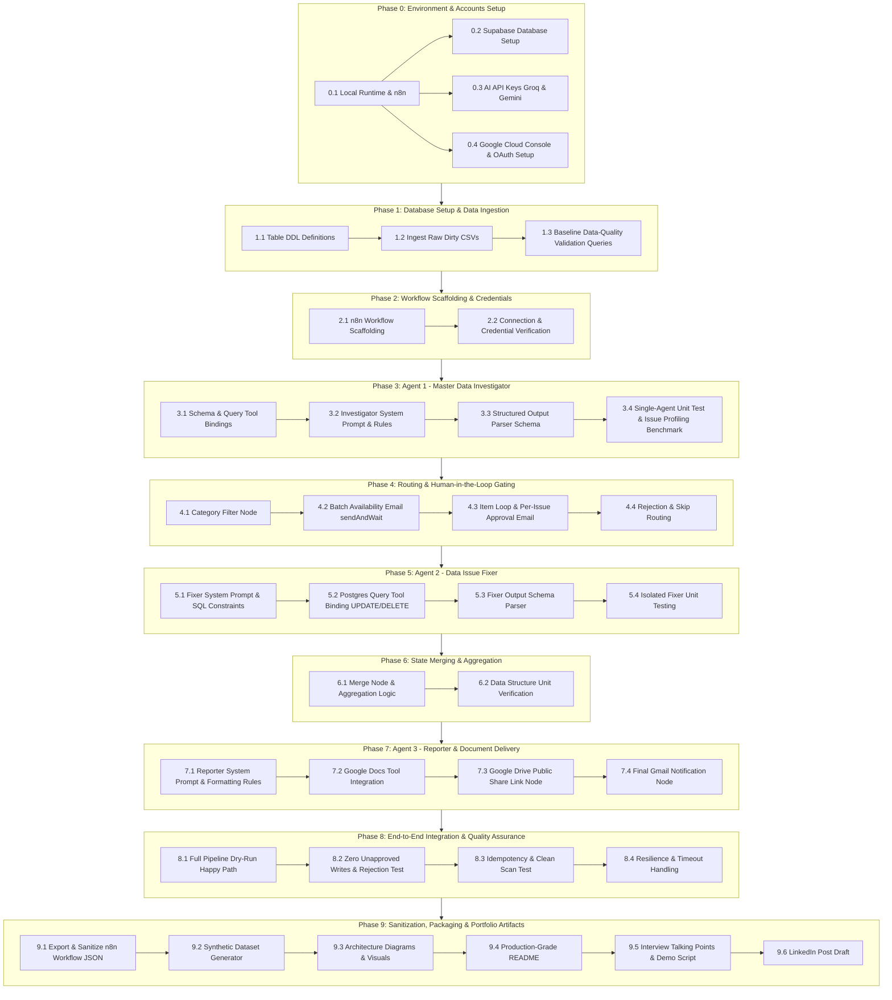

# Tasks: AI Data Governor — Autonomous Data-Quality Audit & Remediation Agent

This document outlines the complete, atomic implementation plan for building, testing, verifying, and packaging the **AI Data Governor** autonomous data-quality multi-agent system.

---

## Dependency Graph & Execution Flow



---

## Phase 0: Prerequisites, Tooling & Environment Initialization

- [x] **TASK-0.1: Initialize Local Node.js and n8n Instance**
  - **Description**: Ensure Node.js (v18.x or v20.x LTS) is installed and install/run n8n locally.
  - **Depends On**: None.
  - **Action Items**:
    - Verify Node.js and npm installations via terminal (`node -v`, `npm -v`).
    - Install n8n globally or run via npx: `npx n8n`.
    - Configure local storage path and ensure n8n UI is accessible at `http://localhost:5678`.
    - Set up initial admin credentials for local n8n.
  - **Acceptance Criteria**: n8n editor opens without errors at `http://localhost:5678`.

- [x] **TASK-0.2: Provision Supabase Database Project ("AtliQ DB")**
  - **Description**: Set up a free-tier Supabase project for the AtliQ dataset.
  - **Depends On**: None.
  - **Action Items**:
    - Create a Supabase project named `AtliQ DB`.
    - Obtain direct database connection parameters: Host, Port (`5432` / `6543`), Database name (`postgres`), User (`postgres`), Password.
    - Test connectivity from a local SQL client (e.g., psql, DBeaver, or Supabase SQL Editor).
  - **Acceptance Criteria**: Successful SQL ping `SELECT version();` executed against Supabase.

- [x] **TASK-0.3: Provision AI Model API Keys (Groq & Gemini)**
  - **Description**: Secure API access for the models specified in the PRD (Groq for investigator scanning; Gemini 2.5 Flash for fixing & reporting).
  - **Depends On**: None.
  - **Action Items**:
    - Create an API key in the Groq Cloud console (verifying access to Kimi K2 or equivalent Groq models).
    - Create an API key in Google AI Studio for Gemini 2.5 Flash.
    - Store keys securely in a local `.env.example` / secrets manager.
  - **Acceptance Criteria**: Valid curl responses verifying both Groq and Gemini API keys respond to simple prompt requests.

- [x] **TASK-0.4: Configure Google Cloud OAuth2 Credentials for Gmail, Docs, and Drive**
  - **Description**: Configure GCP project and OAuth2 credentials so n8n can send approval emails, generate Google Docs, and modify Google Drive file permissions.
  - **Depends On**: None.
  - **Action Items**:
    - Create or use an existing Google Cloud Console project.
    - Enable Gmail API, Google Docs API, and Google Drive API.
    - Configure the OAuth Consent Screen with standard scopes:
      - `https://www.googleapis.com/auth/gmail.send`
      - `https://www.googleapis.com/auth/documents`
      - `https://www.googleapis.com/auth/drive`
    - Create OAuth 2.0 Client ID (Web Application) with redirect URI pointing to n8n's OAuth callback (`http://localhost:5678/rest/oauth2-credential/callback`).
    - Record Client ID and Client Secret.
  - **Acceptance Criteria**: OAuth flow completes in n8n for Gmail, Docs, and Drive without permission errors.

---

## Phase 1: Database Setup & Raw "Dirty" Data Ingestion

- [x] **TASK-1.1: Create Target PostgreSQL Tables (Without Foreign Keys)**
  - **Description**: Execute the DDL to create the 5 tables (`dim_customer`, `dim_market`, `dim_product`, `fact_sales_monthly`, `fact_forecast_monthly`) as defined in PRD Section 10.
  - **Depends On**: TASK-0.2.
  - **Action Items**:
    - Draft `scripts/01_create_tables.sql` defining:
      - `dim_customer` (`customer text`, `market text`, `platform text`, `channel text`, `customer_code text primary key`)
      - `dim_market` (`market text primary key`, `sub_zone text`, `region text`)
      - `dim_product` (`product_code text primary key`, `division text`, `segment text`, `category text`, `product text`, `variant text`)
      - `fact_sales_monthly` (`date date`, `division text`, `category text`, `product_code text`, `product text`, `market text`, `platform text`, `channel text`, `customer_code text`, `customer_name text`, `sold_quantity text`)
      - `fact_forecast_monthly` (`date date`, `division text`, `category text`, `product_code text`, `product text`, `market text`, `platform text`, `channel text`, `customer_code text`, `customer_name text`, `forecast_quantity text`)
    - Intentionally omit foreign key constraints so dirty data loads cleanly without DB-level rejection.
    - Run the DDL script in Supabase SQL Editor.
  - **Acceptance Criteria**: All 5 tables created with 0 rows and correct column types.

- [x] **TASK-1.2: Ingest Raw CSV Files into Supabase Tables**
  - **Description**: Load the dirty CSV data into the 5 created tables, preserving all dirty values, placeholders, and nulls.
  - **Depends On**: TASK-1.1.
  - **Action Items**:
    - Import CSV data using Supabase Table Editor Import, `\copy` command, or a Python staging loader script (`scripts/load_raw_data.py`).
    - Confirm all rows load without truncation or silent data alteration.
  - **Acceptance Criteria**: Row counts match expectations (`fact_sales_monthly` ~21,503 rows, `fact_forecast_monthly` ~21,802 rows, dimensions fully populated).

- [x] **TASK-1.3: Run Profiling Verification Queries to Establish Baseline Ground Truth**
  - **Description**: Verify the exact dirty data anomalies identified in PRD Section 2 exist in the database.
  - **Depends On**: TASK-1.2.
  - **Action Items**:
    - Create `scripts/02_verify_baseline_issues.sql` containing verification queries for:
      - Missing values: count null/blank in `dim_customer.customer`, `platform`, `dim_market.sub_zone`/`region`, `dim_product.category`/`variant`.
      - Placeholder tokens: count `"UNKNOWN"`, `"-"`, etc. in `dim_customer.platform` and `dim_product.category`.
      - Mixed types: count `"X units"` strings in `fact_sales_monthly.sold_quantity` and `fact_forecast_monthly.forecast_quantity`.
      - Inconsistent casing/spaces: `"Atliq Exclusive"` vs `"AltiQ Exclusive"`, `"Amazon "` vs `"Amazon"`.
      - Referential integrity: orphan `customer_code` pattern `ZZZ####` (1,075 rows) and missing `market = 'Canada'`.
      - Duplicates: duplicate count on `fact_sales_monthly`, `fact_forecast_monthly`, `dim_customer`, `dim_product`.
      - Missing dimension linkage: null `customer_name` when `customer_code` is present.
    - Log baseline counts into an internal verification log.
  - **Acceptance Criteria**: Baseline query results match PRD Section 2 metrics.

---

## Phase 2: n8n Workflow Foundation & Credential Wiring

- [x] **TASK-2.1: Import Base Workflow Scaffold or Template**
  - **Description**: Import the initial `data_governor_n8n_template.json` or build the core multi-agent skeleton in n8n.
  - **Depends On**: TASK-0.1.
  - **Action Items**:
    - Import template JSON into n8n via the UI ("Import from File / URL").
    - Rename workflow to `AI Data Governor - Multi-Agent Audit & Remediation`.
    - Identify all nodes showing credential alerts (Postgres, Groq, Gemini, Gmail, Google Docs, Google Drive).
  - **Acceptance Criteria**: Workflow canvas displays all node stages (Trigger -> Investigator -> Filter -> Email Gate -> Loop -> Fixer -> Merge -> Reporter -> Send Link).

- [x] **TASK-2.2: Configure & Verify Credentials in n8n**
  - **Description**: Link all node integrations to the provisioned credentials and test node connections.
  - **Depends On**: TASK-0.2, TASK-0.3, TASK-0.4, TASK-2.1.
  - **Action Items**:
    - Configure **Postgres Credential**: Host, Port, DB, User, SSL enabled (required for Supabase).
    - Configure **Groq Credential**: Set API key.
    - Configure **Google Gemini Credential**: Set API key for Gemini 2.5 Flash.
    - Configure **Google OAuth2 Credentials**: Connect Gmail, Docs, Drive.
    - Execute test queries in the Postgres node (`SELECT 1;`) to verify connectivity.
  - **Acceptance Criteria**: All credential indicator badges turn green; no connection errors.

---

## Phase 3: Agent 1 — Master Data Investigator Implementation

- [x] **TASK-3.1: Bind Database Schema & Query Tools to Investigator Agent**
  - **Description**: Connect schema inspection and read-only query capabilities to the Master Data Investigator agent node.
  - **Depends On**: TASK-2.2.
  - **Action Items**:
    - Attach the Postgres Tool node to the Investigator agent in n8n.
    - Configure tools:
      - `postgres_get_schema`: Reads table and column definitions.
      - `postgres_execute_query`: Configured to execute read-only `SELECT` queries with safety guards.
    - Test tool invocation with a test prompt asking the agent to list tables.
  - **Acceptance Criteria**: Agent successfully executes `SELECT table_name FROM information_schema.tables WHERE table_schema = 'public';` and returns table list.

- [x] **TASK-3.2: Engineer Master Data Investigator System Prompt**
  - **Description**: Author the system prompt defining the Investigator persona, issue categories, scanning strategy, and classification rules.
  - **Depends On**: TASK-3.1.
  - **Action Items**:
    - Configure Model to Groq (Kimi K2).
    - Craft System Message covering:
      - Role: Master Data Health Checker.
      - 9 Scan Checks: Missing/NULL values, placeholder tokens, inconsistent casing/whitespace, mixed data types, outliers, duplicate rows, referential integrity violations, timestamp anomalies, schema drift.
      - Classification rule: Categorize explicitly into `"Fixable with SQL"` or `"Needs Policy Establishment"`.
      - Guidance: Provide concise descriptions (<=200 chars), concrete sample values (1-5 examples), and actionable suggestions (<=200 chars).
      - Strict constraint: Never propose DDL; identify root table and column.
  - **Acceptance Criteria**: Prompt is deployed in the n8n agent node and generates consistent evaluation reasoning.

- [x] **TASK-3.3: Configure Structured Output Parser for Investigator Agent**
  - **Description**: Enforce strict Draft-07 JSON Schema validation on the Investigator agent output.
  - **Depends On**: TASK-3.2.
  - **Action Items**:
    - Attach an n8n **Structured Output Parser** node to the Investigator agent.
    - Define Draft-07 JSON Schema:
      ```json
      {
        "$schema": "http://json-schema.org/draft-07/schema#",
        "type": "array",
        "items": {
          "type": "object",
          "required": ["issue_id", "category", "description", "sample_values", "suggestion"],
          "properties": {
            "issue_id": { "type": "string" },
            "category": { "type": "string", "enum": ["Fixable with SQL", "Needs Policy Establishment"] },
            "description": { "type": "string", "maxLength": 200 },
            "sample_values": { "type": "array", "items": { "type": "string" }, "minItems": 1, "maxItems": 5 },
            "suggestion": { "type": "string", "maxLength": 200 }
          },
          "additionalProperties": false
        }
      }
      ```
    - Configure agent to return empty array `[]` if no issues are detected.
  - **Acceptance Criteria**: Agent output strictly parses as a valid JSON array without markdown formatting (````json...````) or wrapping keys.

- [x] **TASK-3.4: Benchmark Investigator Against Known-Issues Catalog**
  - **Description**: Execute a standalone run of the Investigator agent against the dirty database and evaluate recall.
  - **Depends On**: TASK-1.3, TASK-3.3.
  - **Action Items**:
    - Trigger Investigator agent in n8n.
    - Compare output list against the 7 confirmed issue types from PRD Section 2:
      1. Missing values (dim_customer, dim_market, dim_product)
      2. Placeholder tokens ("UNKNOWN", "-")
      3. Mixed data types ("X units" in sold/forecast quantities)
      4. Inconsistent casing/whitespace ("Atliq Exclusive" vs "AltiQ Exclusive", trailing spaces)
      5. Referential integrity (orphan ZZZ#### codes, missing Canada market)
      6. Duplicate rows (dim_customer, dim_product, facts)
      7. Missing dimension linkage (customer_code without customer_name)
    - Verify that >=90% of known issues are captured.
    - Refine prompt instructions if any major category is omitted.
  - **Acceptance Criteria**: Investigator output captures at least 6 of the 7 core issue categories with accurate classification.

---

## Phase 4: Routing & Human-in-the-Loop Gating Implementation

- [x] **TASK-4.1: Implement Issue Category Filter Node**
  - **Description**: Route issues by classification to ensure only "Fixable with SQL" items proceed to approval and execution.
  - **Depends On**: TASK-3.4.
  - **Action Items**:
    - Add an n8n `Filter` / `Switch` node after the Investigator.
    - Configure condition: `{{ $json.category }} == "Fixable with SQL"`.
    - Route `false` branch ("Needs Policy Establishment") to a passive log branch that bypasses execution and feeds directly into the merge stage.
  - **Acceptance Criteria**: Output branch splits items accurately: auto-fix candidates proceed to approval; policy items are retained for reporting without execution.

- [x] **TASK-4.2: Implement Batch Availability Review Gate (`sendAndWait`)**
  - **Description**: Send a high-level summary email asking the operator for availability before triggering individual issue approvals.
  - **Depends On**: TASK-4.1.
  - **Action Items**:
    - Add Gmail `sendAndWait` node configured with two response buttons: `Yes, I am available` and `No, postpone`.
    - Subject: `[AI Data Governor] Database Audit Completed — Fix Review Required`.
    - Body: Include total count of issues found, count of fixable issues, and count of policy issues.
    - Set up conditional branch after response:
      - If `Yes`: proceed to item loop.
      - If `No`: terminate execution gracefully or route directly to reporter with 0 fixes applied.
  - **Acceptance Criteria**: Workflow enters a waiting state; clicking "Yes" resumes execution; clicking "No" halts fix processing.

- [x] **TASK-4.3: Configure "Loop Over Items" & Per-Issue Approval Gate**
  - **Description**: Iterate through fixable issues one by one and prompt the operator with specific details and proposed fix.
  - **Depends On**: TASK-4.2.
  - **Action Items**:
    - Add n8n `Loop Over Items` (Split In Batches) node, batch size = 1.
    - Inside loop, add Gmail `sendAndWait` node.
    - Subject: `[Action Required] Approve SQL Fix for {{ $json.issue_id }}`.
    - Email content: Render `issue_id`, `description`, `sample_values`, and suggested fix.
    - Options: `Approve Fix` vs `Reject / Skip`.
    - Enforce a 6-second pacing delay between iterations to prevent rate limits.
  - **Acceptance Criteria**: An email is dispatched for each item; workflow waits for user decision before proceeding to the Fixer agent.

- [x] **TASK-4.4: Wire Approval Routing & Rejection Handling**
  - **Description**: Handle approved items by passing them to Fixer, and mark rejected items as "skipped by user".
  - **Depends On**: TASK-4.3.
  - **Action Items**:
    - Add `If` node checking approval response.
    - If `Approved`: pass item to the Data Issue Fixer Agent.
    - If `Rejected`: create a synthetic outcome object:
      ```json
      {
        "issue_id": "{{ $json.issue_id }}",
        "status": "skipped",
        "message": "User rejected SQL remediation during approval gate",
        "executed_sql": "NONE"
      }
      ```
    - Ensure rejected items merge seamlessly into the final report stream.
  - **Acceptance Criteria**: Rejected items bypass Fixer execution and are recorded with `status: "skipped"`.

---

## Phase 5: Agent 2 — Data Issue Fixer Implementation

- [x] **TASK-5.1: Engineer Fixer Agent System Prompt with Safety Constraints**
  - **Description**: Configure Gemini 2.5 Flash as the SQL Generator & Executor with explicit guards against dangerous SQL.
  - **Depends On**: TASK-4.4.
  - **Action Items**:
    - Configure model to Google Gemini 2.5 Flash.
    - Draft System Prompt:
      - Role: Database Remediation Specialist.
      - Input contract: Expects single approved issue (`issue_id`, `category`, `description`, `sample_values`, `suggestion`).
      - Scope restriction: Allowed commands are strictly `UPDATE` and `DELETE`.
      - Prohibited commands: Explicitly forbid `DROP`, `ALTER`, `TRUNCATE`, `CREATE`, `GRANT`, `REVOKE`.
      - Quality rules: Use targeted `WHERE` clauses, handle string trims (`TRIM()`), case standardization (`INITCAP()` / `UPPER()`), regex extraction (`REGEXP_REPLACE()`), and placeholder conversion (`NULLIF()`).
      - Error handling: If query execution fails, capture the exact database error message.
  - **Acceptance Criteria**: Agent prompt enforces strict DML-only rules and includes error handling guidelines.

- [x] **TASK-5.2: Bind Postgres Query Executor Tool to Fixer Agent**
  - **Description**: Connect the Fixer agent to a Postgres execution tool configured for remediation writes.
  - **Depends On**: TASK-5.1.
  - **Action Items**:
    - Attach the Postgres Query tool to the Fixer agent node.
    - Configure the tool to execute the generated query and return row count or error messages.
    - Verify that connection is scoped to target database tables.
  - **Acceptance Criteria**: Tool receives SQL from the agent, executes it against Supabase, and returns execution feedback.

- [x] **TASK-5.3: Configure Structured Output Parser for Fixer Agent**
  - **Description**: Standardize Fixer agent output using a strict JSON schema for downstream merge operations.
  - **Depends On**: TASK-5.2.
  - **Action Items**:
    - Attach n8n **Structured Output Parser** node to the Fixer agent.
    - Define Draft-07 JSON Schema:
      ```json
      {
        "$schema": "http://json-schema.org/draft-07/schema#",
        "type": "array",
        "items": {
          "type": "object",
          "required": ["issue_id", "status", "message", "executed_sql"],
          "properties": {
            "issue_id": { "type": "string" },
            "status": { "type": "string", "enum": ["resolved", "failed"] },
            "message": { "type": "string", "maxLength": 200 },
            "executed_sql": { "type": "string" }
          },
          "additionalProperties": false
        }
      }
      ```
    - Ensure `executed_sql` contains the attempted query even if execution returned an error.
  - **Acceptance Criteria**: Fixer output reliably conforms to the schema on both success and failure.

- [x] **TASK-5.4: Execute Isolated Unit Tests for Fixer Agent**
  - **Description**: Test the Fixer on 3 distinct issue types to verify SQL syntax and data modifications.
  - **Depends On**: TASK-5.3.
  - **Action Items**:
    - Test 1 (Whitespace & Casing): Run fix on `dim_customer.customer` (`"Amazon "` and `"AltiQ Exclusive"`).
    - Test 2 (Placeholder Conversion): Run fix converting `"-"` or `"UNKNOWN"` in `dim_product.category` to `NULL`.
    - Test 3 (Unit Suffix Removal): Run fix stripping `" units"` from `fact_sales_monthly.sold_quantity`.
    - Query Supabase directly after each test to confirm data state reflects the fix.
  - **Acceptance Criteria**: SQL executes cleanly; target records are updated; `executed_sql` and `status: "resolved"` are returned.

---

## Phase 6: State Merging & Aggregation

- [x] **TASK-6.1: Implement Merge & Aggregation Logic**
  - **Description**: Combine original scanned issues (fixable + policy items) with the fix execution results into a unified payload.
  - **Depends On**: TASK-4.4, TASK-5.4.
  - **Action Items**:
    - Add an n8n `Merge` node or `Code` (JavaScript) node after the approval loop completes.
    - Join datasets on `issue_id`.
    - Format composite payload:
      ```json
      {
        "data": [
          {
            "issue_id": "ISSUE-001",
            "category": "Fixable with SQL",
            "description": "...",
            "suggestion": "...",
            "status": "resolved",
            "executed_sql": "UPDATE ...",
            "message": "Successfully trimmed trailing spaces"
          },
          {
            "issue_id": "ISSUE-002",
            "category": "Needs Policy Establishment",
            "description": "...",
            "suggestion": "...",
            "status": "policy_pending",
            "executed_sql": "N/A",
            "message": "Requires business rule definition"
          }
        ]
      }
      ```
  - **Acceptance Criteria**: Combined JSON array contains 100% of detected issues with complete lineage (scan details + execution outcomes).

- [x] **TASK-6.2: Validate Aggregation Edge Cases**
  - **Description**: Verify data integrity across scenarios where fixes failed, were rejected, or where 0 issues were found.
  - **Depends On**: TASK-6.1.
  - **Action Items**:
    - Simulate a scenario with 1 resolved issue, 1 skipped issue, 1 failed issue, and 1 policy issue.
    - Confirm all items appear in `data` array without dropped keys or undefined values.
  - **Acceptance Criteria**: Merged object passes schema validation and preserves all statuses.

---

## Phase 7: Agent 3 — Reporter & Document Delivery Implementation

- [x] **TASK-7.1: Author Reporter Agent Prompt & Markdown Rules**
  - **Description**: Configure Gemini 2.5 Flash to synthesize the merged issue report into structured Google Docs elements.
  - **Depends On**: TASK-6.2.
  - **Action Items**:
    - Configure model to Gemini 2.5 Flash.
    - Author System Prompt:
      - Document Title: `Database Health Check Report – YYYY-MM-DD`.
      - Section 1: Executive Summary (concise overview of tables scanned, issues found, resolved, and pending).
      - Section 2: Fixed Issues (bulleted list: `issue_id`, `description`, formatted SQL block with indentation, outcome).
      - Section 3: Discussion & Policy Items (bulleted list: `issue_id`, `description`, recommended policy action).
      - Section 4: Skipped / Failed Issues (if applicable).
  - **Acceptance Criteria**: Agent outputs clean, formatted document structure without extraneous chat commentary.

- [x] **TASK-7.2: Implement Google Docs Creation & Content Insertion**
  - **Description**: Configure n8n Google Docs node to instantiate the report document and apply typography styles.
  - **Depends On**: TASK-7.1, TASK-0.4.
  - **Action Items**:
    - Add Google Docs node: Action `Create a document`.
    - Set document title: `Database Health Check Report – {{ $today }}`.
    - Add subsequent Google Docs node to write generated content (Title, Headings, Bullets, Code blocks).
    - Capture `documentId` and `documentUrl` from node output.
  - **Acceptance Criteria**: Google Doc is created in Google Drive with rendered headings, bullets, and executed SQL blocks.

- [x] **TASK-7.3: Configure Google Drive Public Sharing Permission**
  - **Description**: Update Google Doc file permissions via Google Drive node to enable "Anyone with the link can view".
  - **Depends On**: TASK-7.2.
  - **Action Items**:
    - Add Google Drive node: Action `Update File Permissions` or `Share File`.
    - Target: `{{ $node["Google Docs"].json["documentId"] }}`.
    - Role: `reader` (view-only).
    - Type: `anyone`.
    - Output public shareable link (`webViewLink`).
  - **Acceptance Criteria**: Opening the generated link in an incognito/private browser window loads the document without requiring Google login.

- [x] **TASK-7.4: Implement Final Notification Email via Gmail**
  - **Description**: Dispatch final completion email to the operator containing executive summary metrics and public report link.
  - **Depends On**: TASK-7.3.
  - **Action Items**:
    - Add Gmail node: Action `Send Email`.
    - To: Operator email address.
    - Subject: `[Completed] AtliQ Database Health Check Report Available`.
    - Body: Include run timestamp, count of issues fixed vs policy-flagged, and a prominent hyperlink button to the Google Doc.
  - **Acceptance Criteria**: Operator receives the notification email with a functioning link to the newly created report.

---

## Phase 8: End-to-End Integration, Quality Assurance & Edge Testing

- [x] **TASK-8.1: Full End-to-End Workflow Dry-Run (Happy Path)**
  - **Description**: Execute the entire n8n workflow from Manual Trigger through final email delivery on a fresh dirty dataset.
  - **Depends On**: TASK-1.2, TASK-3.4, TASK-4.3, TASK-5.4, TASK-7.4.
  - **Action Items**:
    - Re-seed Supabase database with fresh dirty CSV data.
    - Click `Test workflow` / Manual Trigger in n8n.
    - Complete the availability approval email ("Yes").
    - Approve 3 consecutive SQL fixes ("Approve").
    - Verify Fixer executes queries.
    - Verify Google Doc generates and final email arrives.
  - **Acceptance Criteria**: Complete workflow finishes with green status across all nodes; Google Doc contains executed SQL; email link works.

- [x] **TASK-8.2: Verify Zero Unapproved Writes & Rejection Branching**
  - **Description**: Rigorously prove that unapproved issues are never executed against the database.
  - **Depends On**: TASK-8.1.
  - **Action Items**:
    - Run workflow; when prompted with per-issue approval email, click `Reject / Skip`.
    - Verify Fixer node is bypassed for that item.
    - Query Supabase database to confirm target row remained untouched.
    - Verify the Google Doc includes the item under "Skipped / Not Fixed Issues".
  - **Acceptance Criteria**: Zero writes performed for rejected items; 100% human-in-the-loop compliance verified.

- [x] **TASK-8.3: Idempotency & Clean Database Scan Verification**
  - **Description**: Re-run the audit against the database after fixes have been applied to verify clean scanning behavior.
  - **Depends On**: TASK-8.1.
  - **Action Items**:
    - Trigger workflow on the remediated database.
    - Inspect Investigator agent output.
    - Confirm previously fixed items are no longer flagged.
    - Confirm that if only policy items remain, workflow skips the SQL approval loop and proceeds directly to the report.
  - **Acceptance Criteria**: Investigator returns empty array `[]` for resolved categories; no repeat fixes are generated.

- [x] **TASK-8.4: Fault-Tolerance & Timeout Verification**
  - **Description**: Verify workflow behavior under failure conditions (bad LLM output, database connection blips, email timeouts).
  - **Depends On**: TASK-8.1.
  - **Action Items**:
    - Test Structured Output Parser error handling by feeding malformed mock JSON.
    - Verify that n8n raises an alert and halts safely rather than sending corrupt data downstream.
    - Test Fixer response when an invalid SQL query is attempted (syntax error simulation).
    - Verify Fixer logs `status: "failed"` and includes error message without crashing workflow.
  - **Acceptance Criteria**: Failures fail loud and are recorded gracefully in report output.

---

## Phase 9: Sanitization, Packaging & Portfolio Artifacts

- [x] **TASK-9.1: Export & Sanitize n8n Workflow JSON**
  - **Description**: Export the complete n8n workflow and purge all sensitive API keys, credentials, and email addresses.
  - **Depends On**: TASK-8.4.
  - **Action Items**:
    - Export workflow from n8n to `workflow/data_governor_n8n_workflow.json`.
    - Run automated/manual regex search for:
      - API keys (`AIza...`, `gsk_...`, Supabase service role keys)
      - Email addresses (replace with `operator@example.com`, `approver@example.com`)
      - Supabase project URLs and passwords (replace with placeholders `YOUR_SUPABASE_HOST`, `YOUR_DB_PASSWORD`)
      - Google OAuth client IDs and secrets
    - Verify exported JSON can be imported into a clean n8n instance without revealing secret strings.
  - **Acceptance Criteria**: Workflow file is 100% sanitized and ready for public repository publication.

- [x] **TASK-9.2: Create Synthetic Sample Dataset & Data Generator**
  - **Description**: Create sanitized, synthetic versions of the 5 AtliQ CSVs for public inclusion in GitHub without licensing/proprietary data issues.
  - **Depends On**: TASK-1.2.
  - **Action Items**:
    - Build `scripts/generate_synthetic_dataset.py` to create a lightweight sample dataset (~500 rows per fact table, ~50 rows per dimension).
    - Intentionally seed the exact same data-quality anomalies:
      - Trailing spaces & casing anomalies in customer names
      - "UNKNOWN" and "-" placeholder tokens in category/platform
      - String suffixes ("9 units") in quantity columns
      - Orphan foreign key codes (`ZZZ9901`)
      - Missing dimension links
      - Duplicate rows
    - Save files into `data/synthetic_raw/`.
  - **Acceptance Criteria**: Synthetic dataset reproduces all 7 data-quality issues and is safe for public distribution.

- [x] **TASK-9.3: Generate Architecture & Flow Visualizations**
  - **Description**: Create clean architecture diagrams and workflow screenshots for documentation.
  - **Depends On**: TASK-8.1.
  - **Action Items**:
    - Create system architecture diagram (Mermaid + rendered SVG/PNG in `docs/architecture.png`).
    - Capture high-resolution screenshot of the complete n8n workflow canvas (`docs/n8n_workflow_canvas.png`).
    - Capture sample Gmail approval email screenshot (`docs/gmail_approval_demo.png`).
    - Capture sample Google Doc report screenshot (`docs/sample_report_preview.png`).
  - **Acceptance Criteria**: High-resolution image assets saved in `docs/` ready for README embedding.

- [x] **TASK-9.4: Draft Production-Grade Repository README**
  - **Description**: Write a recruiter-focused README structured for rapid evaluation (<2 minute skim).
  - **Depends On**: TASK-9.1, TASK-9.2, TASK-9.3.
  - **Action Items**:
    - Structure README:
      1. **Headline & Value Proposition**: Autonomous data governance agent for sales/forecast databases.
      2. **Architecture Diagram**: Visualizing the 3-agent pipeline and double approval gate.
      3. **Confirmed Data-Quality Issues Table**: Listing the 7 real-world issues surfaced and remediated.
      4. **Design Choices & Safeguards**: Why 3 separate agents, why human approval is mandatory, DML vs DDL restrictions.
      5. **Quickstart & Setup**: Step-by-step instructions to run locally with Supabase + n8n.
      6. **Sample Deliverables**: Direct link to a live sample Google Doc report and screenshots.
      7. **Production Roadmap**: What to enhance for enterprise scale (Airflow/Composer, Slack approvals, DB audit table).
  - **Acceptance Criteria**: README.md is comprehensive, visually engaging, and adheres to portfolio standards.

- [x] **TASK-9.5: Develop Interview Talking Points & 2-Minute Demo Script**
  - **Description**: Document key interview narratives connecting this governance automation project to commercial business impact.
  - **Depends On**: TASK-9.4.
  - **Action Items**:
    - Draft `docs/interview_narrative.md` covering:
      - The "Why": Data engineering/governance foundation behind Business Insights 360 dashboards.
      - Architectural justification: Why separate LLMs (Groq Kimi K2 for cost/speed on scan; Gemini 2.5 Flash for reasoning on fix & report).
      - Risk defense: Why fully autonomous writes are a compliance hazard in BFSI/fintech and why human-in-the-loop gating is the superior design.
      - Contract enforcement: Why Draft-07 JSON Schema validation via Structured Output Parsers was chosen over plain text prompting.
      - 2-minute elevator pitch script.
  - **Acceptance Criteria**: Concise, defensible interview talking points ready for interview preparation.

- [x] **TASK-9.6: Author Project Announcement Post (LinkedIn)**
  - **Description**: Draft a public post announcing the project release following established portfolio project patterns.
  - **Depends On**: TASK-9.4, TASK-9.5.
  - **Action Items**:
    - Draft `docs/linkedin_post.md`:
      - Hook: The hidden cost of dirty data before it reaches executive dashboards.
      - What was built: 3-agent n8n orchestration system on PostgreSQL.
      - Key technical highlights: Schema-enforced agents, double human approval gate, automated Google Doc health reports.
      - GitHub repository and sample report links.
      - Relevant hashtags (#DataGovernance #DataEngineering #AIAgents #n8n #PostgreSQL).
  - **Acceptance Criteria**: Ready-to-publish LinkedIn post written with clear technical grounding and business context.

---

## Phase Checklist Summary

| Phase | Title | Atomic Tasks | Critical Dependency |
|---|---|---|---|
| **Phase 0** | Prerequisites, Tooling & Environment Initialization | TASK-0.1 to 0.4 | Initial setup |
| **Phase 1** | Database Setup & Raw "Dirty" Data Ingestion | TASK-1.1 to 1.3 | Depends on Phase 0 |
| **Phase 2** | n8n Workflow Foundation & Credential Wiring | TASK-2.1 to 2.2 | Depends on Phase 0 & 1 |
| **Phase 3** | Agent 1 — Master Data Investigator Implementation | TASK-3.1 to 3.4 | Depends on Phase 2 |
| **Phase 4** | Routing & Human-in-the-Loop Gating Implementation | TASK-4.1 to 4.4 | Depends on Phase 3 |
| **Phase 5** | Agent 2 — Data Issue Fixer Implementation | TASK-5.1 to 5.4 | Depends on Phase 4 |
| **Phase 6** | State Merging & Aggregation | TASK-6.1 to 6.2 | Depends on Phase 4 & 5 |
| **Phase 7** | Agent 3 — Reporter & Document Delivery Implementation | TASK-7.1 to 7.4 | Depends on Phase 6 |
| **Phase 8** | End-to-End Integration, Quality Assurance & Edge Testing | TASK-8.1 to 8.4 | Depends on Phase 1–7 |
| **Phase 9** | Sanitization, Packaging & Portfolio Artifacts | TASK-9.1 to 9.6 | Depends on Phase 8 |
